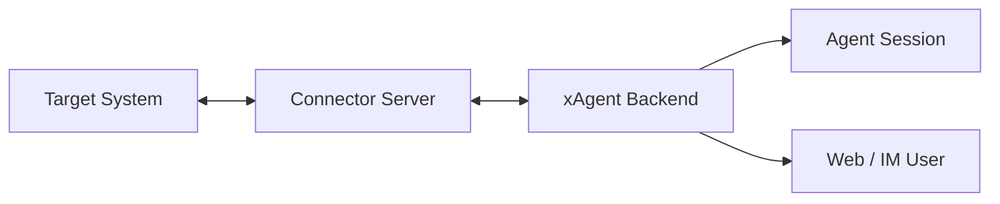

# xAgent Connectors

[简体中文](README.zh-CN.md)

This repository is the public protocol, source, and release index for xAgent
connectors.

Connector binaries are published through GitHub Releases. Official connector
source code lives under `connectors/<name>` when it is open-sourced here.

Documentation:

<https://xagent.xiagaogao.com>

## What Is a Connector

A Connector is a server-side bridge between xAgent and an external system such
as WeChat, email, business software, or a custom service. It runs outside the
xAgent process and owns the target system protocol, login state, message queue,
media cache, and tool execution.

xAgent talks to a Connector through a small common contract: it reads the
Connector Card and Skill, opens a WebSocket data plane, invokes declared tools,
and receives inbound messages as session events. The Connector keeps target
system tokens and private protocol details inside its own service.



For connector developers, the important boundary is simple: expose stable
capabilities to xAgent, keep external system secrets inside the Connector, and
only publish tools that actually work for the current connection.

## Developer Documents

Connector developers do not need to understand xAgent internals first. Start
from the common protocol, then use the architecture note only to clarify
state ownership, lifecycle, and safety boundaries.

- [Connector Common Protocol](docs/xagent_connector_protocol.md): wire contract
  for Connector Card, HTTP endpoints, WebSocket packets, tools, auth, messages,
  and media.
- [Connector Architecture](docs/xagent_connection_architecture.md): role,
  lifecycle, communication planes, state ownership, and safety boundaries.

## Go Packages

- [`connectors/protocol`](connectors/protocol): shared wire-contract models and
  constants used by xAgent and connector implementations. The root Go module
  only owns this protocol surface and intentionally has no connector
  implementation dependencies.
- [`connectors/wechat`](connectors/wechat): official WeChat Connector source
  and release metadata. It is a separate Go module with its own runtime
  dependencies.

## Connectors

| Connector | Directory | Release Tag Pattern | Description |
| --- | --- | --- | --- |
| WeChat Connector | [`connectors/wechat`](connectors/wechat) | `wechat-v*` | Connects xAgent with WeChat IM scenarios. |

## Download

Download connector binaries from:

<https://github.com/coffeehc/xagent-connectors/releases>

The current WeChat Connector release uses:

```text
wechat-v0.0.1.beta
```

Connector releases use connector-scoped tag names so each connector can publish
independently.

## Verify Artifacts

When a release provides `SHA256SUMS`, verify downloaded files before
installation:

```bash
shasum -a 256 -c SHA256SUMS
```

## Repository Scope

This repository stores connector protocol models, implementation source,
release metadata, manifests, installation notes, protocol documents, and release
assets. xAgent core runtime code stays in the xAgent main repository; external
system integration code belongs in connector directories here.
