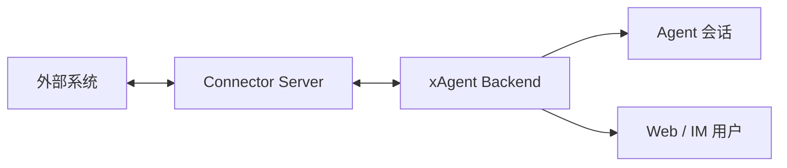

# xAgent Connectors

[English](README.md)

本仓库是 xAgent 连接器的公开协议、源码和发布索引仓库。

连接器二进制文件通过 GitHub Releases 发布。已经开源的官方连接器源码放在 `connectors/<name>` 下。

使用文档：

<https://xagent.xiagaogao.com>

## 什么是连接器

连接器是 xAgent 与外部系统之间的服务端桥接服务，例如微信、邮件、业务系统或自定义服务。它运行在 xAgent 进程之外，负责目标系统协议、登录态、消息队列、媒体缓存和工具执行。

xAgent 通过一组小而稳定的协议与连接器通信：读取 Connector Card 和 Skill，打开 WebSocket 数据通道，调用连接器声明的工具，并把外部入站消息转换成会话事件。目标系统 token、登录态和私有协议细节都应保留在连接器服务内部。



对连接器开发者来说，最重要的边界很简单：向 xAgent 暴露稳定能力，把外部系统密钥和私有协议留在连接器内部，并且只声明当前连接真实可用的工具。

## 开发文档

开发连接器不需要先理解 xAgent 的内部实现。建议先从通用协议开始，再把架构说明作为状态归属、生命周期和安全边界的参考。

- [Connector 通用协议](docs/xagent_connector_protocol.md)：说明 Connector Card、HTTP endpoint、WebSocket packet、工具、认证、消息和媒体的协议约定。
- [Connector 架构说明](docs/xagent_connection_architecture.md)：说明连接器角色、生命周期、通信平面、状态归属和安全边界。

## Go 包

- [`connectors/protocol`](connectors/protocol)：xAgent 和连接器实现共享的 wire contract 模型与常量。根 Go module 只拥有协议面，不携带 connector 实现依赖。
- [`connectors/wechat`](connectors/wechat)：官方 WeChat Connector 源码和发布元数据。它是独立 Go module，拥有自己的运行时依赖。

## 连接器列表

| 连接器 | 目录 | Release Tag 规则 | 说明 |
| --- | --- | --- | --- |
| WeChat Connector | [`connectors/wechat`](connectors/wechat) | `wechat-v*` | 用于将 xAgent 接入微信 IM 场景。 |

## 下载

请从 GitHub Releases 页面下载连接器二进制文件：

<https://github.com/coffeehc/xagent-connectors/releases>

当前微信连接器发布使用：

```text
wechat-v0.0.1.beta
```

连接器使用按连接器区分的 tag 命名，便于每个连接器独立发布。

## 校验

如果 Release 提供 `SHA256SUMS`，建议安装前先校验下载文件：

```bash
shasum -a 256 -c SHA256SUMS
```

## 仓库边界

本仓库保存连接器协议模型、实现源码、发布元信息、manifest、安装说明、协议文档和 Release 附件。xAgent 核心运行时代码仍留在 xAgent 主仓库；外部系统适配代码归属本仓库的连接器目录。
