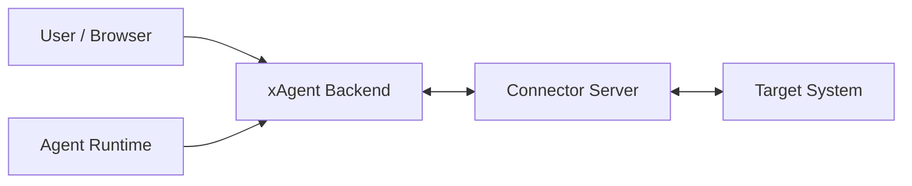

# xAgent Connector Architecture

本文档定义 xAgent Connector 的架构边界、事实归属和生命周期。HTTP endpoint、WebSocket packet、JSON 字段、状态枚举和第三方实现要求见
[xAgent Connector Common Protocol](xagent_connector_protocol.md)。

## 1. 定位

Connector 是运行在 xAgent 进程外的外部系统桥接服务。它负责把目标系统的登录态、消息、文件和操作能力投影成 xAgent 可治理的连接、事件和工具。

Connector 不是普通 Skill，也不是 xAgent 内部插件：

- Skill 只告诉 Agent 如何理解事件、如何使用工具。
- Connector Server 持有目标系统协议和登录态。
- xAgent 持有系统级接入事实、用户到 Connector channel 的归属索引、工具投影和 SessionEvent 转换。



## 2. 事实边界

| 角色 | 拥有事实 | 不拥有 |
| --- | --- | --- |
| xAgent | Connector catalog、`server_base_url`、系统 API key、Connector Card/Skill 缓存、`connector_id`、用户与 `connector_channel_id` 的归属索引、WebSocket 路由、Agent 工具投影、SessionEvent 转换、本地治理策略 | 目标系统登录态、目标系统 token、目标联系人事实、Connector 内部队列、Connector 媒体映射 |
| Connector Server | `connector_id` 分配和校验、`connector_channel_id` 分配、目标系统登录态、目标系统权限、Connection Descriptor、工具执行、入站消息缓存、媒体引用、目标系统协议细节 | xAgent 用户权限体系、xAgent 会话治理策略、Agent 内部执行流程、xAgent 持久化 schema |
| Agent / LLM | 当前会话可见工具、Connector Skill、用户可见消息正文、业务参数 | 系统 API key、`connector_id`、`connector_channel_id`、目标系统 token、transfer token、WebSocket packet |

边界原则：

- `server_base_url` 归 xAgent connector catalog 管理，不写入 Connector Card，也不由 Connector 本地配置决定公开访问根地址。
- `connector_card_id` 和 Connector 展示名是 Connector 开发时确定的稳定协议常量，不应由部署者运行时改名。
- 目标系统登录态只在 Connector 内。
- xAgent 只保存 Connector 分配的 ID 和必要投影。
- Connector 不理解 xAgent 的完整用户权限模型，只服务 xAgent 打开的 `connector_channel_id`。
- xAgent 不解析目标系统私有协议，例如微信 iLink、OAuth provider API、IMAP 细节。
- `connector_channel_id` 是路由和绑定索引，不是鉴权凭证。

## 3. 核心模型

### 3.1 BaseConnector

BaseConnector 是 xAgent 系统级 connector catalog 事实。

它由 `connectormanageservice` 写入，包含：

- `connector_card_id`
- `connector_id`
- `name` / `version` / `vendor`
- `server_base_url`
- 加密落盘的系统 API key
- protocol / protocol version
- Connector Card 快照
- health 状态和最近错误摘要

BaseConnector 不包含目标系统账号、token、联系人或用户登录态。

### 3.2 Connector Card

Connector Card 是 Connector 未绑定前的静态能力声明。

它回答：

- 这个 Connector 是什么。
- 稳定 `connector_card_id` 是什么。
- 支持哪些 target type、target provider 和 profile。
- 有哪些真实存在的工具。
- 有哪些认证流程。
- xAgent 如何生成基本登录 UI。

Card 不表达某个用户是否已经登录，也不表达某个 channel 当前工具是否可用。

### 3.3 ConnectorClient

xAgent 为每个 `connector_card_id` 维护一个系统级 ConnectorClient。

ConnectorClient 持有：

- HTTP client，用于读取 Card、Skill、health 和 transfer endpoint。
- WebSocket data plane。
- outbound send queue。
- 当前 `connector_id`。
- 活跃 `connector_channel_id -> user/session/runtime` 路由。

页面刷新、状态读取、工具调用和重连必须复用同一个 ConnectorClient，不能各自创建 WebSocket 线路。

### 3.4 connector_id

`connector_id` 是 Connector 为当前 xAgent 系统分配的系统级身份 ID。

规则：

- 首次 WebSocket `connector.hello` 时 xAgent 可传空。
- Connector 返回 `connector.hello.ack` 并分配 `connector_id`。
- xAgent 写回 BaseConnector。
- 后续连接必须携带已保存的 `connector_id`。
- 如果 Connector 返回不同的 `connector_id`，xAgent 视为身份异常，不能覆盖本地事实。

`connector_id` 不是 `connector_card_id`。

### 3.5 connector_channel_id

`connector_channel_id` 是 Connector 在 `connector_id` 命名空间下分配的用户级持久 channel ID。

规则：

- xAgent 首次打开用户 channel 时发送空 `connector_channel_id`。
- Connector 分配并返回新的 `connector_channel_id`。
- xAgent 持久化 `user_id + connector_card_id + connector_channel_id` 归属索引。
- xAgent 重启后会重新打开已持久化且仍有效的 channel。
- Connector 可以在无法识别旧 channel 时重新分配 channel；xAgent 收到新 ID 后更新原用户绑定。

### 3.6 Connection Descriptor

Connection Descriptor 是绑定后的用户级动态投影。

它回答：

- 当前 channel 绑定到哪个目标系统身份或资源。
- 当前 connection 状态是什么。
- 当前哪些 `tool_id` 可用。

Descriptor 只描述当前 channel，不描述 Connector 全局能力。Card 中没有的工具不能出现在 Descriptor 中，Descriptor 中不可用的工具不能投影给 Agent。

### 3.7 Connector Skill

Connector Skill 是 Connector 给 Agent 的运行时说明。

它回答：

- 入站事件应该如何理解。
- 回复或处理时应该使用哪个工具。
- 工具参数应该如何填写。
- 哪些行为不能伪造。

Skill 不保存状态，不包含密钥，不替代 Card 或 Descriptor。

## 4. 三个通信平面

### 4.1 Control Plane

Control Plane 是系统级 HTTP 读取和健康检查。

它负责：

- 读取 Connector Card。
- 读取 Connector Skill。
- 探测 Connector health。

Control Plane 不执行用户级工具，也不传文件正文。

### 4.2 Data Plane

Data Plane 是 WebSocket packet bus。

它负责：

- 系统级 `connector.hello`。
- 打开和关闭用户 channel。
- 用户认证流程。
- descriptor 同步。
- `tool.invoke`。
- 入站 `message.push`。
- `ping` / `pong` 和错误回包。

Data Plane 只传结构化 packet，不传文件正文、base64 或目标系统 CDN 字节流。

### 4.3 Transfer Plane

Transfer Plane 处理文件、图片、视频等字节流。

它负责：

- xAgent 后端向 Connector 上传待发送文件，换取 `media_ref`。
- xAgent 后端从 Connector 下载入站媒体。
- Connector 管理 `media_ref -> 目标系统媒体/本地缓存` 的映射和过期策略。

前端、Agent 和 LLM 不能直接持有系统 API key、目标系统 CDN token 或临时下载密钥。

## 5. 标准生命周期

### 5.1 接入 Connector

```text
Admin 输入 Connector Base URL 和可选 API key
xAgent 拉取 /connector-card.json
xAgent 拉取 /skill.md
xAgent 探测 /health
xAgent 保存 BaseConnector、Card 快照和 Skill 缓存
xAgent 注册 Connector 工具 runtime
```

接入阶段只建立系统级 Connector 事实，不自动创建用户 channel。

### 5.2 建立系统连接

```text
xAgent 打开 /ws data plane
xAgent -> connector.hello(connector_card_id, connector_id?)
Connector -> connector.hello.ack(connector_id)
xAgent 校验并保存 connector_id
```

`connector.hello.ack` 完成前不能发送用户级 packet。

### 5.3 打开用户 channel

```text
User 点击连接
xAgent -> channel.open(connector_channel_id = "")
Connector -> channel.open.ack(connector_channel_id, connection_descriptor)
xAgent 保存 user_id 与 connector_channel_id 的绑定
```

如果用户已有持久化 channel，xAgent 可以带旧 `connector_channel_id` 重新 `channel.open`。Connector 能识别则复用，不能识别则重新分配并返回新 ID。

### 5.4 用户认证

认证必须在已打开 channel 上进行。

```text
xAgent -> auth.start(flow_id)
Connector -> auth.start.ack(...)
xAgent -> auth.status(auth_session_id, refresh?)
Connector -> auth.status.ack(...)
Connector -> connection.descriptor.push(optional)
```

认证状态属于认证流程，Connection Descriptor 的 `connection.status` 属于用户连接投影。最终 UI 状态以最新 Descriptor 回正。

`auth.cancel` 只取消未完成的认证会话，不等于登出目标系统。

### 5.5 工具调用

```text
Agent 调用 connector tool
xAgent 根据当前用户和 channel 封装 tool.invoke
Connector 执行目标系统操作
Connector -> tool.invoke.ack(result or error)
```

工具调用中：

- `tool_id` 必须来自 Connector Card。
- `connector_channel_id` 由 xAgent runtime 注入，不让 LLM 填。
- Connector 必须按当前 channel 的目标系统权限校验工具是否可用。
- 业务失败返回 `tool.invoke.ack.error`。
- 协议、身份、路由错误返回 `type = error`。

### 5.6 入站消息

Connector 负责从目标系统接收消息，并推给 xAgent。

```text
Connector 从目标系统收到消息
Connector 写入本地 pending 队列
如果 channel 已打开，Connector -> message.push
xAgent 将 message.push 转换为主会话 SessionEvent
Agent 处理消息
Agent 如需回复，调用 Connector 工具
```

如果 xAgent 尚未启动或 channel 未打开，Connector 必须缓存消息。缓存消费游标和过期策略由 Connector 管理。

IM 类型 Connector 可以在消息成功投递给 channel 后自动向目标系统发送 typing/正在输入状态；等后续发送回复时取消，或超时取消。typing 是 Connector runtime 反馈，不需要暴露成 LLM 工具。

### 5.7 关闭和登出

`channel.close` 和 `auth.logout` 是两个不同动作：

- `channel.close` 只关闭当前运行时 channel 路由，不删除 xAgent 持久化绑定，也不删除 Connector 内目标系统登录态。
- `auth.logout` 要求 Connector 清理目标系统登录态；xAgent 在成功后删除本地 channel 绑定和运行时路由。

## 6. Card、Descriptor、Skill 的关系

三者职责不能混用：

| 对象 | 性质 | 生命周期 | 内容 |
| --- | --- | --- | --- |
| Connector Card | 静态能力清单 | 接入时读取，版本变化时刷新 | connector 身份、target/profile、auth flow、真实工具 schema |
| Connection Descriptor | 用户级运行态投影 | channel.open/auth/status/push 时刷新 | 当前 channel 状态、目标账号展示、工具可用性 |
| Connector Skill | Agent 行为说明 | 接入时下载，版本变化时刷新 | 如何处理事件、如何使用工具、禁止伪造什么 |

## 7. 工具投影

Connector 工具是动态 runtime 投影，不是全局永久工具。

xAgent 投影流程：

1. 从 Connector Card 读取工具定义。
2. 从 Connection Descriptor 读取当前 channel 的工具状态。
3. 叠加 xAgent 本地治理策略。
4. 只把当前用户、当前会话可用的工具注入 Agent runtime。

规则：

- Connector 提供的工具必须真实存在。
- 不允许把未来可能支持、但当前调用会 404 的能力放进 Card。
- 不允许伪造联系人搜索、文件搜索等目标系统不存在的工具。
- LLM 看到的是 `tool_id + description + schema`。
- LLM 不看到 `connector_channel_id`、系统 API key、目标系统 token。
- 如果多个 channel 同时提供同名 `tool_id`，xAgent 必须能解析唯一 channel；无法解析时不能注入该工具。

## 8. 入站消息模型

`message.push` 是 Connector 主动推送目标系统入站消息的标准 packet。

来源链分层：

1. Connector 补目标系统内部来源，例如发送方 display name、群聊、消息类型。
2. xAgent connectManager 补 Connector 来源，例如“微信消息”。
3. sessionEvent/sessionEngine 把它转换成用户消息，不解析具体目标系统私有字段。

`activation_message` 可以给 Agent 提供任务指令，但不等同于用户可见正文。只要 `text/content/message` 存在，xAgent 就应优先用它生成会话消息。

## 9. 媒体和资源引用

Connector 媒体模型：

```text
目标系统媒体 / Connector 本地缓存
  -> media_ref
  -> download_url
  -> xAgent ResourceRef
  -> session attachment / workspace file
  -> Agent 可读文件
```

规则：

- 入站媒体由 Connector 尽早下载或缓存，避免目标系统 CDN 过期。
- `media_ref` 是 Connector 内部不透明 key。
- `download_url` 可以是绝对 URL，也可以是相对 URI；相对 URI 由 xAgent 用 catalog 中的 `server_base_url` 补全。
- `download_url` 只能由 xAgent 后端或资源解析器消费。
- xAgent 可以把 Connector media 解析成本地 session attachment，再作为普通文件进入多模态模型请求。
- 大文件不走 WebSocket，不走 tool 参数，不走 base64。

语音消息属于 Connector 语义判断：

- 如果目标系统已经给出语音转文字，Connector 可以作为文本消息推送。
- 如果目标系统不能解析，Connector 不应强迫 xAgent 做 ASR；可以按普通媒体或不可解析事件处理。

## 10. 状态、缓存和恢复

xAgent 持久化：

- BaseConnector。
- Connector Card 快照。
- Connector Skill 缓存。
- `connector_id`。
- `user_id + connector_card_id + connector_channel_id` 归属索引。
- 最近一次用户认证状态、激活状态和错误摘要，用于 UI 初始展示和回正触发。

xAgent 不持久化：

- 目标系统登录态。
- 目标系统 token。
- Connection Descriptor 作为目标系统长期事实。
- 目标系统联系人事实。
- Connector pending message 队列。
- Connector media 映射事实。

Connector 持久化：

- 目标系统登录态或授权材料。
- `connector_id + connector_channel_id` 到目标身份的绑定。
- 入站消息 pending 队列。
- 每个 channel 的消费游标。
- 媒体 `media_ref` 映射和本地缓存路径。

恢复规则：

- xAgent 重启后，按持久化 UserConnectorState 并发恢复有效 channel。
- Connector 重启后，按自身持久化登录态、channel 绑定、pending 队列和媒体映射恢复。
- `message.push` 只能投递到已打开 channel；channel 未打开时 Connector 应保留 pending 队列，等待后续 `channel.open` 后 flush。
- pending 消息必须有过期策略，例如按消费游标清理，同时硬过期清理。
- xAgent data plane 会自动重连；连续失败达到上限后停止自动重试，等待用户或管理员动作触发恢复。

## 11. 安全约束

必须遵守：

1. 系统 API key 只存在于 xAgent 后端和 Connector Server 之间。
2. 目标系统 token 只存在于 Connector 内。
3. 前端、Agent、Skill、Card、Descriptor、tool 参数、message payload 都不能包含系统 API key 或目标系统 token。
4. `connector_channel_id` 和 `request_id` 都不是鉴权凭证。
5. Connector 必须校验系统连接身份、`connector_id`、`connector_channel_id` 和工具权限。
6. Connector Card 可以公开，但不能包含密钥、一次性二维码、OAuth state、目标系统登录态或真实敏感身份。
7. Connection Descriptor 只能包含展示级账号信息和脱敏提示。
8. 有副作用工具必须具备幂等或重复调用识别能力。
9. Connector 返回的工具结果不得携带目标系统 token、bot token、context token 或 API key。
10. 日志不得记录系统 API key、目标系统 token、临时下载密钥或目标系统 CDN 签名原文。

## 12. 版本和兼容

`connector.version` 表示 Connector Card 和 Connector 自身能力版本。

Protocol version 表示 xAgent Connector 协议版本。

兼容规则：

- 新增可选字段通常只需要升级 `connector.version`。
- 新增工具、auth flow、profile 或 Skill 内容，也升级 `connector.version`。
- 删除工具、修改 `tool_id`、修改既有字段语义、把可选参数改必填，属于破坏性变更。
- 修改 packet envelope、ID 校验规则、必选 packet 或核心状态语义，必须升级 Protocol version。
- xAgent 发现 `connector.version` 变化后，应重新拉取 Card 和 Skill，并刷新工具投影。
